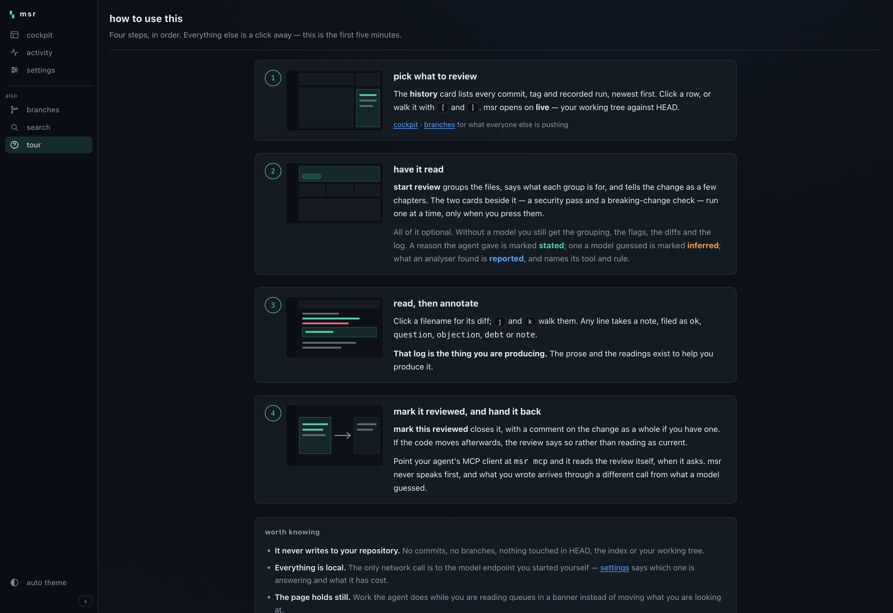
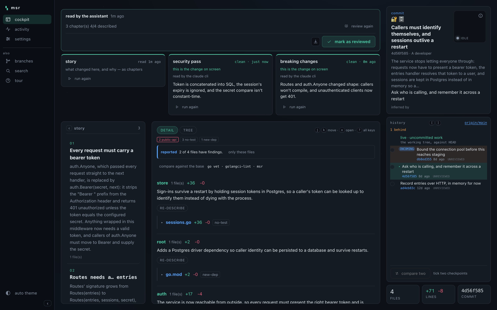
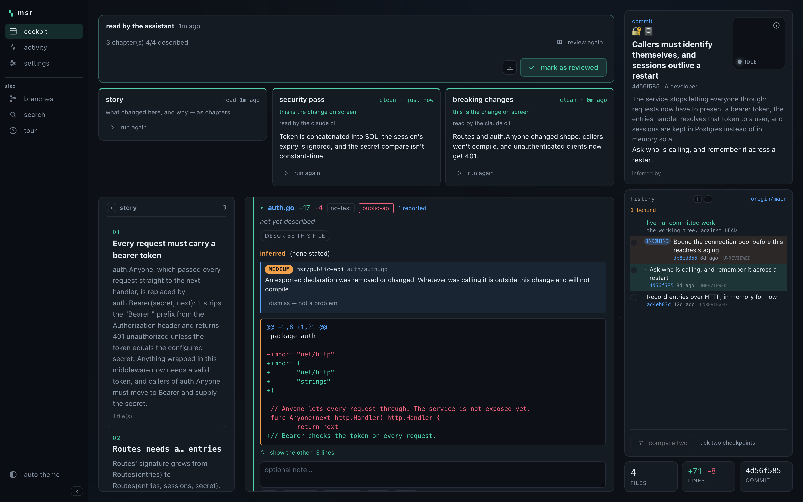
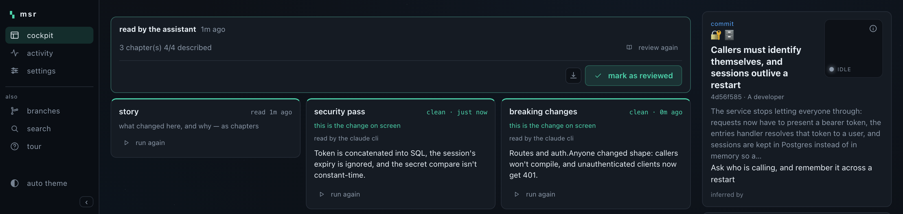
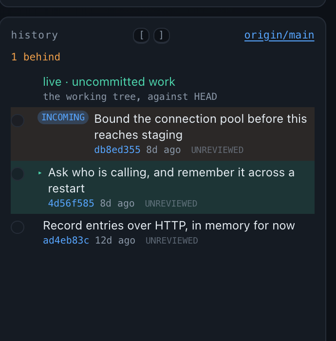
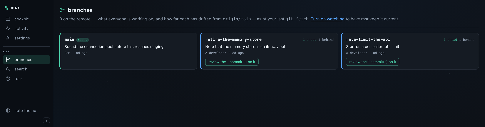
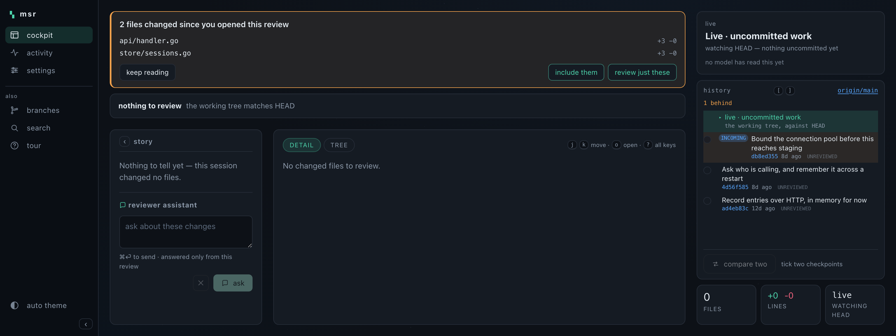
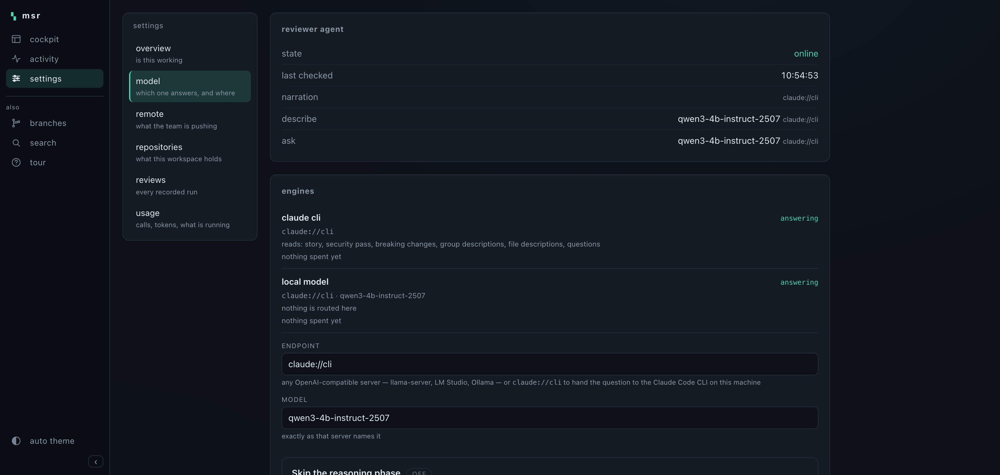

# mondspace-reviewer (`msr`)

**Review what your coding agent actually did — in your browser, while it works.**

`msr` reads a repository's git history and turns any part of it into a review you
can actually read: the change told as a story, beside the real diffs, with a
local model explaining what each piece is *for*. It watches; it never writes to
your code or your agent — and when your agent wants to know what you said, it
asks over MCP.

[](https://github.com/mondial7/mondspace-reviewer/actions/workflows/ci.yml)
[](https://pkg.go.dev/github.com/mondial7/mondspace-reviewer)
[](LICENSE)

---

## Install

Two things: the reviewer, and a local model for the prose. The model is
optional — without it you still get grouping, flags, diffs and the review log,
just no sentences.

**1. Install msr**

```sh
brew install mondial7/tap/mondspace-reviewer   # macOS
# or: go install github.com/mondial7/mondspace-reviewer/cmd/mondspace-reviewer@latest
```

**2. Start a local model** (optional, but it is most of the value)

```sh
brew install llama.cpp

llama-server -hf bartowski/Qwen_Qwen3-4B-Instruct-2507-GGUF:Q6_K \
  --host 127.0.0.1 --port 8081 -c 32768 -fa on \
  --cache-type-k q8_0 --cache-type-v q8_0 --jinja
```

About 3.3 GB, downloaded once. Leave it running — `msr` looks for it at
`127.0.0.1:8081`. Any OpenAI-compatible server works instead: point `msr` at it
on `/settings`, or with `--summarizer-url`.

**3. Open a repository**

```sh
cd ~/your-project
msr web
```

It opens `http://127.0.0.1:7777` on the newest thing worth reviewing. No
configuration, no database, no account, and **no session to record first**.

It binds to localhost, and refuses anything else unless you pass
`--allow-remote`: msr serves your source, your diffs and your review notes with
no authentication at all, so putting it on a network is a decision rather than a
typo.

Then press **`?`** in the app, or open
[`/tutorial`](http://127.0.0.1:7777/tutorial), for the four things to do in
order — it is also on the [project page](https://mondial7.github.io/mondspace-reviewer/).



> **How much memory?** The 4B at Q6_K needs roughly 4–5 GB resident at a 32k
> context — comfortable on 16 GB, easy on 32 GB. Running a *second*, larger
> model alongside it is measurably not worth it: on a 24 GB machine that made
> every call about four times slower, and the larger model was *less* reliable
> on the hardest request ([ADR 0019](ADR/0019-llama-server-and-a-model-per-workload.md)).

<details>
<summary><strong>macOS: "Apple could not verify mondspace-reviewer…"</strong></summary>

`msr` is **not signed with an Apple Developer ID**, so anything you download —
a release tarball, or the binary inside the Homebrew cask — arrives carrying a
quarantine attribute, and macOS refuses to run it. It offers you only *Move to
Bin*, which is unhelpfully final.

Installing with `brew` handles this: the cask strips the attribute during
install, **before** the binary is ever run. That ordering matters — once macOS
has refused a binary it remembers the decision for that path, and clearing the
attribute afterwards does not lift it. If you hit the dialog once already:

```sh
brew reinstall mondspace-reviewer
```

If you downloaded a tarball by hand, do the same thing yourself:

```sh
xattr -dr com.apple.quarantine ./mondspace-reviewer
```

Be clear about what that does: it **skips Gatekeeper's check for that file**.
Only do it for a binary you got from
[this project's releases](https://github.com/mondial7/mondspace-reviewer/releases)
and whose checksum matches the `checksums.txt` published alongside it:

```sh
shasum -a 256 -c checksums.txt --ignore-missing
```

The proper fix is a Developer ID signature and Apple notarisation, which needs a
paid Apple developer account. It is not done yet — see
[issue tracker](https://github.com/mondial7/mondspace-reviewer/issues).

</details>

That's it. It opens `http://127.0.0.1:7777` on the newest thing worth reviewing.
No configuration, no database, no account, and **no session to record first** —
it reads the git history that is already there.

Everything works offline. The prose is optional: point `msr` at any
OpenAI-compatible endpoint — a local
[llama.cpp](https://github.com/ggml-org/llama.cpp) server by default — and it
degrades to a mechanical grouping when there is none.

## Why you would want it

Reviewing an agent's work is a specific kind of miserable. The diff is large, it
arrives all at once, and the *why* is buried in a transcript you no longer want
to read. `msr` attacks exactly that:

- **Net change, not keystrokes.** One reviewable unit per changed file, so an
  agent editing the same file eleven times reads as one change with one diff —
  and you can still open the eleven if you want them.
- **Meaning, not filenames.** Files that changed together are grouped, and each
  group gets one sentence about what the change is *for*. "edited jsonl.go" is
  never shown: the filename above it already said that.
- **`stated` vs `inferred`, always.** A rationale in the agent's own words looks
  different — different colour *and* label — from one a model guessed. A model
  can sharpen a headline; it can never assert a reason nobody gave.
- **Flags with no model at all.** `no-test`, `new-dep`, `swallowed-err`,
  `public-api`, `large`, `todo` — offline, instant, and what make you stop.
  `new-dep` means a dependency **manifest** changed (`go.mod`, `package.json`,
  a lock file), not that a file gained an import.
- **Every number is a git fact.** Files, lines, commits, tags, pull requests.
  Nothing on the panel is model-derived, which is the point of putting it beside
  a narration feature.

## What you can review

Anything in git, not just recorded agent runs:

| | |
| --- | --- |
| **a commit** | `parent..commit` — what that one commit did |
| **a tag** | everything since the previous tag — "what shipped in v4.1.0" |
| **a pull request** | the commits that reference it, together |
| **live** | the working tree against HEAD, updating as you watch — offered first, always |
| **an agent session** | a recorded run, if you installed the hooks |

Pick from the selector at the top left — repository first, then what in it. Or
**compare two points** you choose: any tag, branch or commit against any other,
reviewed exactly like anything else. A recorded session is *one kind among
them*, not the index — and every other target lists the sessions that overlap
it, so the intent behind a commit is one click away ([ADR 0017](ADR/0017-git-first-review.md)).

## Using the cockpit



One page, three columns. Only the two right-hand ones scroll.

| | |
| --- | --- |
| **panel** (fixed) | what this change is, in a sentence; a live isometric field; the numbers |
| **story** | the change as chapters of prose, and the reviewer assistant |
| **changes** | every file, folded, with its diff, history and annotation |

A card across the top says whether the assistant has read what you are looking
at, how long ago, how far it got, and gives you the button to read it again —
which is the first thing you want to know after switching target.



**Analyse, on demand.** Three readings of the same change, each run when you
ask and never before:

| | |
| --- | --- |
| **Story** | what changed here, and why — as chapters |
| **Security pass** | what in this change is worth a second look |
| **Breaking changes** | what this could break for existing callers |



They share nothing. No analysis is shown another's findings, and running one
never triggers another — two independent readings of a diff are worth more than
one reading twice. Each is capped at five findings by its schema rather than by
asking the model nicely, and each finding is a file and one sentence. There is
no severity: a small local model rating something "critical" is false precision,
so the card says `inferred — worth a look, not a verdict`
([ADR 0024](ADR/0024-analyses-as-independent-cards.md)).

A card is never ambiguous about which of these it means: *nobody has run this*,
*it could not run*, and *it ran and found nothing* look different, which on a
security card is the difference between information and a false sense of safety.

**Keep an eye on the rest of the team.** A history card in the panel shows where
you are against everything that has landed — the commit you are reviewing, what
you have already signed off, what has not left your machine, and what a
colleague has pushed that is not here yet. Every row opens that commit.



**The wider view.** `/branches` lists every branch on the remote with how far
each has drifted from the mainline, who last pushed to it and when. **Ahead is
the number that matters** — it is how much there would be to review, and the row
opens exactly that: the range `main..their-branch`, reviewed like anything else.
Merged branches stay listed but dimmed, since there is nothing left on them.



By default msr reads whatever your own last `git fetch` or `git pull` brought
in. To have it watch the remote itself, either start it with the flag or flip it
on `/settings` while it runs:

```sh
msr web --fetch --fetch-every=2m
```

That is opt-in on purpose: fetching talks to the network and writes
remote-tracking refs, and msr otherwise does neither. It never touches HEAD,
your index or your working tree — there is a test for exactly that. When a
colleague pushes you get a toast naming who: *"3 new commits on origin/main ·
Alice"* ([ADR 0025](ADR/0025-watching-the-remote.md)).

**Hide what nobody reviews.** An agent's diff is full of `go.sum`, generated
mocks, protobuf output and `vendor/`. Put a `.msrignore` at the repository root,
in gitignore syntax:

```gitignore
vendor/
node_modules/
*.pb.go
mock_*.go
*.generated.go
```

There are **no defaults** — nothing is left out of a review unless you asked for
it, and hiding lockfiles by default would mask the very dependency change
`new-dep` exists to flag. When rules are active the page always says how many
files were hidden, which ones, and the pattern that did it, with one click to
show them anyway ([ADR 0027](ADR/0027-ignoring-generated-files.md)).

**Read.** Start with what happened in a folder, then ask what happened to one
file in it — both are a click, and both are one sentence about what the change
is *for*. Click a chapter and its files come up beside it. Click a filename to
open its diff; long diffs are compacted with the hunk headers kept, and
`open full history` steps through that file's git history with `←`/`→`. A
**tree** toggle swaps the diffs for an indented folder listing when you want the
shape rather than the detail.

**Annotate a line.** Click any added or removed line in a diff to write a note
about that line — it renders there, and it is anchored to the line's *text*, so
it survives the diff growing above it. If the line later disappears the note is
kept and marked as no longer anchored rather than quietly dropped or quietly
shown as current ([ADR 0028](ADR/0028-notes-on-lines.md)).

**Annotate.** Every change takes a note and one of `ok` · `question` ·
`objection` · `debt` · `note`. **The review log is the product** — the prose and
the assistant exist only to help you produce it. Export it when you are done.

**Ask.** The assistant answers only from this review: the diffs, the log, and
your own notes. Never a re-read of the repo, never the open internet.

**Watch.** The **live** target is the working tree against HEAD, and it is where
msr opens. It keeps its identity when a commit lands, so your notes and the
story survive the commit instead of being swapped out from under you
([ADR 0018](ADR/0018-live-target-and-pulses.md)).



While you read, it **holds still**. Work the agent does after you opened it does
not appear underneath you — it queues up in a banner that names the files and
tells you which of them you have already annotated, because a note you wrote
against a version that no longer exists is the thing worth interrupting for.
Then you choose: **keep reading**, **include them** in what you are reviewing,
or **review just these** — which opens the delta on its own, as an ordinary
range ([ADR 0020](ADR/0020-pin-the-review-queue-the-rest.md)).

Whatever you are looking at, msr tells you when the repository moves: a commit,
a tag, or files changing. It arrives as a small toast in the corner naming what
happened, and clicking it opens that commit or tag — which msr has already
discovered, so the link works. Nothing is announced on arrival, and nothing is
announced while the tab is in the background; the content is up to date either
way.

**Finish.** When you are done with a target, **mark it reviewed** and leave a
closing comment on the change as a whole. It is remembered, so reopening it
tomorrow says so — and a signed-off target is ticked in the picker, so what is
left to look at is readable from the list. If the code moved after you signed
off, it says that too rather than reading as current
([ADR 0021](ADR/0021-finishing-a-review.md)).

**Search it.** `/search` looks through every note, question, answer and finding
across every review in the workspace — because the review log is the product,
and "where did I write that about the retry loop" should have an answer. Every
word has to match, and hits are grouped by the review they belong to.

**Dismiss a finding.** An audit run twice repeats itself, so a finding you have
already decided is not a problem can be dismissed. It stays on the card, greyed,
and the dismissal is carried onto later runs — unless the model now says
something *different* about that file, which is a new claim nobody has ruled on
([ADR 0030](ADR/0030-searching-judging-and-who-can-reach-it.md)).

**Keys.** Reading is the common case, so it has the short keys:

| | | | |
| --- | --- | --- | --- |
| `j` `k` | next / previous file | `[` `]` | previous / next review |
| `o` | open the file | `{` `}` | previous / next repository |
| `g` `G` | first / last file | `/` | jump to the picker |
| `a` | ask about these changes | `r` | mark this review done |
| `?` | every shortcut | | |

Plus the shell's three, on every page: `⌘K` a palette over every page and every
changed file · `⌘Z` hides the sidebar and the instrument panel · `⌘J` cycles
the five themes. All of
them are ignored while you are typing ([ADR 0022](ADR/0022-keyboard-navigation.md)).

Every model call is slow on a local model, so the waiting is visible: a spinner
in the sidebar from any page, and `/settings` showing what is running, what it cost,
and a button to run it again.

### Choosing the model

The endpoint and model are set on `/settings` — type them, press apply, and it
takes effect at once. No restart, no file to find. Settings that cannot be
reached are refused with the reason rather than saved and left to fail quietly
later.

They are remembered in `~/.config/mondspace-reviewer/config.json` (override with
`--config`). Four sources, most deliberate first:

```
a flag you passed  →  MSR_SUMMARIZER_URL / MSR_MODEL  →  the stored settings  →  the defaults
```

A flag left at its default does **not** override what you configured — passing
`--model` means it for that run, not merely running `msr web` at all.

### The other pages

- **`/activity`** — every model call and every change to the review, across the
  whole workspace.
- **`/settings`** — one pane at a time: an **overview** of whether this is
  working at all, then the model, the remote, the repositories, every review,
  and usage. Is your model online, what it has spent (split into prompt,
  completion and *of which reasoning*), what the assistant is doing right now,
  and the repositories you are watching — one click to add another or stop
  watching one. Unwatching closes a window; nothing on disk is touched.

## Several repositories at once

```sh
msr web --repo=. --repo=../api --repo=../web
```

With no `--repo`, `msr` opens the checkout you are in — or, if you are in a
directory *of* checkouts, the first few of them. The rest appear on `/settings`
under *found nearby*, one click from being watched. Nothing is asked at launch:
choosing belongs where it can change without a restart.

Each repository keeps its own store under `<repo>/.mondspace-reviewer`, and a
review remembers which repository it belongs to.

## Watching an agent live

Reviewing git needs nothing. To also capture an agent's **stated intent** — its
own words about why it did something — install the hooks:

```sh
msr install-hooks --dir=.
```

Four hooks, each an atomic append of one JSON line that exits immediately: your
agent runs fine whether or not `msr` is attached, and attaching later replays the
whole log. `--source=opencode` tails an OpenCode log instead.

That is the only thing sessions add — and it is why they are worth having, not
why they should be the index.

## Handing the review back to your agent

The point of a review is that the thing being reviewed changes. Until v6.1 that
meant reading the cockpit and retyping the relevant parts into your agent's
prompt.

`msr mcp` serves the review over MCP, on stdin/stdout. Point your coding agent's
client at it:

```json
{"mcpServers": {"msr": {"command": "msr", "args": ["mcp"]}}}
```

`.mcp.json` for Claude Code, or the equivalent in whatever you use. Then ask
your agent to *"check what the reviewer said"* and it pulls.

**It never speaks first.** There is no hook, no injected message, no file it
watches. A working agent is not interrupted with something nobody asked for at a
moment nobody chose — it asks when it wants to know, and msr answers.

| tool | what it gives back |
| --- | --- |
| `review_status` | which change is open, whether a human signed it off and what they said, how much is outstanding. Cheap — ask this first |
| `review_feedback` | what the reviewer is **still asking for**: questions, objections, debt, in their own words. Optionally one file |
| `review_file` | the whole human record of one file, approvals included |
| `model_findings` | what msr's audits **inferred**, behind a name that says so |
| `workspace_feedback` | outstanding feedback across *every* review. Expensive |
| `workspace_search` | find anything written anywhere in the workspace. Expensive |

The split is the point. The first three serve only what a person typed. The
judge msr runs is a small local model: right often enough to be worth reading,
wrong often enough that acting on it unverified is a mistake. So its findings
have their own call, each reply opens by disowning human authorship, and each
finding names the model and asks to be checked. Without that, a finding the
model invented arrives in your agent's context indistinguishable from your
objection — and msr then audits the result with the same model, a loop with no
human in it.

A finding you **dismissed** is still shown, marked settled: an agent that cannot
see the dismissal raises the same thing again.

It is read-only, and it reads the store rather than your code — no git, no
model, no network. Leave it configured; the worst it can do is report what you
wrote. Your agent cannot write to the review, which is deliberate: a review log
the agent can edit is not a review of the agent.

See [ADR 0031](ADR/0031-an-agent-pulls-the-review.md).

## The command line

The web app is the product. The CLI is there for scripting and for looking at a
review without a browser.

```sh
msr help                      # every command
msr help <command>            # one command's flags

msr export --format=md --session=<id>       # write the review up
msr export --format=slack --session=<id>    # one message, ready to post
msr ask --session=<id> "did the retry change have a stated reason?"
msr review --plain --since=v4.0.0           # line-oriented, scriptable
msr gc --dry-run                            # tidy throwaway review refs
msr mcp                                     # serve the review to a coding agent
```

Try the whole pipeline with no agent, terminal or network:

```sh
msr review --source=replay --file=testdata/sessions/basic.jsonl --plain
```

Each unit prints a `WHAT` and a `WHY`, coloured by source: green where the agent
said why in its own words, amber where a model inferred it. That distinction is
the same everywhere, including the web app.

<details>
<summary><strong>The terminal UI (unmaintained)</strong></summary>

`msr review --tui` still opens the original bubbletea queue: `j`/`k` to move,
`enter` to expand, `o`/`q`/`x`/`d`/`n` to annotate, `a`/`A` to ask, `f` to filter
flagged, `e` to export.

It works, and it is **no longer developed**. Everything since v3 — the cockpit,
git-first review, workspaces, grouped changes, the assistant — is web only, and
the TUI will not catch up. Use `msr web`; use `--plain` when you want text.

</details>

## Summarizer configuration

The assistant uses any OpenAI-compatible chat endpoint. The default is a local
[llama.cpp](https://github.com/ggml-org/llama.cpp) server:

```sh
brew install llama.cpp

llama-server -hf bartowski/Qwen_Qwen3-4B-Instruct-2507-GGUF:Q6_K \
  --host 127.0.0.1 --port 8081 -c 32768 -fa on \
  --cache-type-k q8_0 --cache-type-v q8_0 --jinja
```

That is the whole setup — `msr web` finds it at `http://127.0.0.1:8081/v1`. Any
other OpenAI-compatible server works too:

```sh
msr web --summarizer-url=http://localhost:1234/v1 --model=qwen/qwen3.5-9b
```

For an endpoint that requires authentication, set a bearer token via the
environment — it is never written to disk:

```sh
export MSR_API_KEY=sk-…
```

### Why this model

The three jobs are not one problem: narration is a large schema whose area names
are an `enum`, per-file description is short and high-volume, and asking is free
prose. Measured on an M4 Pro with 24 GB, 6 runs each at temperature 0:

| | Qwen3-4B-Instruct-2507 Q6_K | Qwen3.5-9B Q4_K_M |
| --- | --- | --- |
| narration | **6/6 valid**, every area name real | **0/6** — spends the whole budget thinking and never answers |
| latency | 6.7–8.9s | 64–115s, no answer |
| reasoning tokens | **none — no thinking mode at all** | cannot be turned off |

The small instruct model wins outright, so it answers everything. Running the 9B
alongside it made the 4B four times slower (6.8s → 28s) from memory pressure
alone — on 24 GB a second model has to earn a lot to be worth loading.



### A model per workload

If you do want to split — a bigger model for narration, a fast one for the rest
— every workload can be pointed somewhere else, from the flags, the environment,
or the settings on `/settings`:

```sh
msr web --narration-url=http://127.0.0.1:8082/v1 --narration-model=big
```

`--describe-*` and `--ask-*` work the same way, as do `MSR_NARRATION_URL`,
`MSR_DESCRIBE_MODEL` and so on. Anything left empty falls back to the shared
endpoint and model, field by field, so two models behind one server is just a
model name. Distinct models are connected to once and their usage is added up:
`/settings` shows which model answers what, and reports online only when *all* of
them do.

### Structured output

The story is requested as **schema-enforced JSON** (`response_format:
json_schema`). llama.cpp compiles the schema into a GBNF grammar, so the reply is
valid JSON by construction, and the list of allowed area names is an `enum` — a
model *cannot* name an area that does not exist. An endpoint that rejects the
schema is retried without it, so this can never break a working setup.

The effect on a reasoning model is not subtle. Same prompt, same 32k context,
`qwen3.5-9b`:

| request | completion tokens | finish | time |
| --- | --- | --- | --- |
| plain | 299 (all reasoning) | `length` — truncated, no answer | 107s |
| schema-enforced | 54 | `stop` — complete JSON | **2.2s** |

Left to itself the model reasons until it runs out of budget and returns
nothing. The grammar simply does not let it.

### Reasoning models, and two flags that do not help

If you point msr at a model that thinks, two llama-server flags look like the
answer and are worth knowing about before you reach for them.

`--reasoning-format none` **breaks schema-constrained requests**. With a
`json_schema` in force on Qwen3.5-9B it fails outright — `400 Failed to
initialize samplers`, for any schema, trivial ones included. It is harmless on a
model with no thinking mode, which is also the only case where it does nothing.
Leave it off.

`--reasoning-budget 0` **does not stop the thinking**, at least on Qwen3.5-9B: it
spent 334 completion tokens producing `{"a": "Hello"}`. This is the same result
as LM Studio's `chat_template_kwargs.enable_thinking=false`, which msr can still
send (`MSR_NO_THINKING=1`) and which was also measured as doing nothing on that
model. Some templates honour these; do not count on yours without measuring.

msr requires the answer in `content`. If a server puts it in `reasoning_content`
instead — LM Studio does this for grammar-constrained replies — the call fails
and says so, naming the flag that causes it. It used to read the answer out of
the reasoning channel, which worked and hid the difference between a model that
answered and one that only thought ([ADR 0019](ADR/0019-llama-server-and-a-model-per-workload.md)).

If the endpoint is unreachable, `msr` silently falls back to mechanical headlines
(files + change counts) and an offline notice for questions — **the queue never
waits on the model.** The model can improve a headline's *what*, but it can never
assert a `stated` rationale: that discipline lives in a [pure function](internal/usecase/summarize.go).

### On large reviews

A 600-file range renders in about half a second, and the first load — before
anything is cached — in about one. Getting there was two bug fixes rather than
any limit: the review cache was being discarded on every request, and each
changed file was diffed in its own `git` process. Neither was visible from
reading the code; both took one profile ([ADR 0029](ADR/0029-large-reviews.md)).

```sh
go test ./internal/adapter/presenter/web/ -run=NONE -bench=Cockpit
```

## Testing

```sh
go test ./...              # unit + integration, no network, no agent
go test -race ./...
go vet ./...
```

The prompts are load-bearing code, so they have their own tests against a real
model. They seed a repository with a known SQL injection, a hardcoded secret, an
auth bypass and a changed exported signature, and assert the audits catch each —
and, just as importantly, stay quiet on a change with nothing wrong in it:

```sh
MSR_SUMMARIZER_URL=http://127.0.0.1:8081/v1 MSR_MODEL=qwen3-4b-instruct-2507 \
  go test -tags=model -timeout=20m ./internal/integration/...
```

They build real repositories and diff them with git rather than using
hand-written diffs — a prompt has to be tested against exactly what production
feeds it.

One contract test talks to a real model server and is gated behind a tag:

```sh
MSR_SUMMARIZER_URL=http://127.0.0.1:8081/v1 MSR_MODEL=qwen3-4b-instruct-2507 \
  go test -tags=integration ./internal/adapter/summarizer/openai/...
```

## Status

**v6.1.0** — the review reaches the agent.

- **Cockpit** (`msr web`) — one page: the change as a story, the diffs,
  annotation, re-analysis, a live isometric field, and a workspace spanning any
  number of repositories.
- **Git-first review** — commits, tags, pull requests, the working tree, and
  recorded sessions, all reviewed by the same net-change-per-file engine
  ([ADR 0017](ADR/0017-git-first-review.md)).
- **The review log is a real artefact** — notes on individual lines, searchable
  across the workspace, exportable as markdown, JSON or Slack, and signed off
  per target with a closing comment.
- **Live watching** — a target that follows HEAD and keeps its identity across a
  commit, a toast when the repository moves, and work that arrives mid-review
  queued as a choice rather than folded in silently
  ([ADR 0018](ADR/0018-live-target-and-pulses.md),
  [ADR 0020](ADR/0020-pin-the-review-queue-the-rest.md)).
- **Finishing a review** — mark a target reviewed with a closing comment, held
  across restarts and honest about going stale
  ([ADR 0021](ADR/0021-finishing-a-review.md)).
- **Keyboard navigation** across files, reviews and repositories
  ([ADR 0022](ADR/0022-keyboard-navigation.md)).
- **A tour built in** at `/tutorial`, and a project page with real screenshots.
- **Analysis cards** — story, security pass and breaking-change check, each run
  on demand and independent of the others
  ([ADR 0024](ADR/0024-analyses-as-independent-cards.md)).
- **Line-level notes**, a `.msrignore` for generated files, export from the app,
  workspace search and finding triage
  ([ADR 0027](ADR/0027-ignoring-generated-files.md)–[0030](ADR/0030-searching-judging-and-who-can-reach-it.md)).
- **A history card** and a **branches page**, with an opt-in watch on the remote
  so you see what the rest of the team pushes — toggled from `/settings` without a
  restart ([ADR 0025](ADR/0025-watching-the-remote.md),
  [ADR 0026](ADR/0026-the-wider-view.md)).
- **Schema-enforced model output**, on-demand descriptions, persisted
  conversations, and full accounting of every call and token at `/activity` and
  `/settings`.
- **MCP server** (`msr mcp`) — your coding agent pulls the review when it wants
  it, never interrupted. What a human wrote and what a model inferred arrive
  through separate calls ([ADR 0031](ADR/0031-an-agent-pulls-the-review.md)).
- **Deterministic flags** and the `stated`/`inferred` discipline, both offline.
- **Storage**: append-only JSONL by default, or PostgreSQL in a dedicated schema.
- **Ingestion** from Claude Code hooks or OpenCode, for stated intent.
- **The TUI is unmaintained.** It still works; it will not gain anything new.

Decisions are recorded in [`ADR/`](ADR); planned work in
[issues](https://github.com/mondial7/mondspace-reviewer/issues).

## Contributing

This project is built strictly test-first. See [CONTRIBUTING.md](CONTRIBUTING.md).

Working on the web app? The templates and stylesheet are embedded in the binary,
so `air` does the rebuilding:

```sh
go install github.com/air-verse/air@latest
air        # http://127.0.0.1:7777, rebuilt on every save
```

## Security

Found a vulnerability? See [SECURITY.md](SECURITY.md).

## License

[MIT](LICENSE) © Marco Mondini
